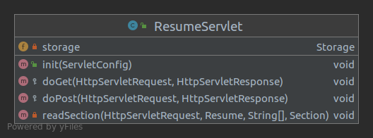
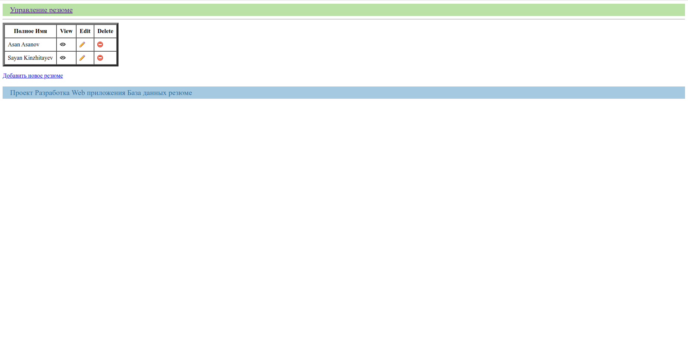
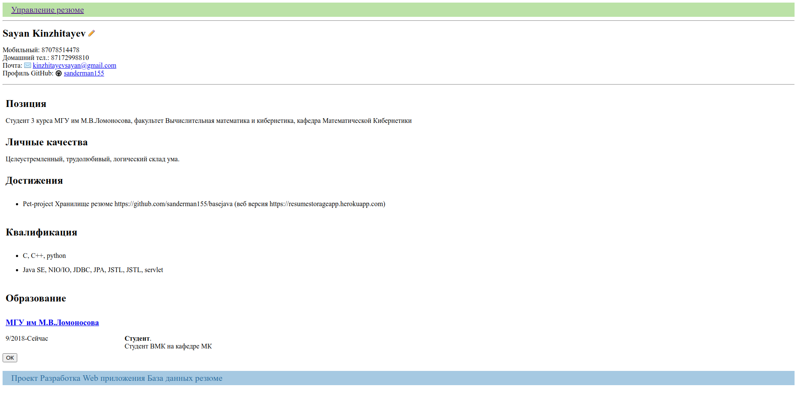
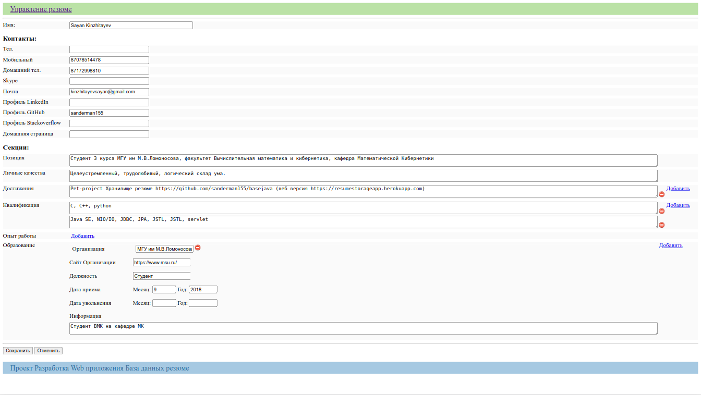
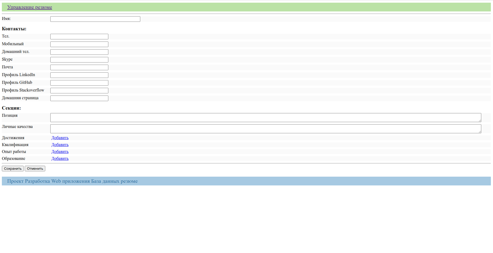
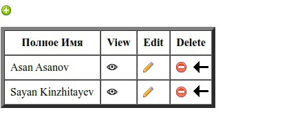

# Проект Хранилище Резюме
***
## Резюме
Модель резюме описана в пакете ru.javaops.webapp.model

Как видно из диаграммы, резюме состоит из:
* Уникального идентификатора(uuid)
* Полного имени(fullName)
* Контактов(contacts)
* Секций(sections)

### Контакты

* PHONE - рабочий телефон
* MOBILE - мобильный телефон
* HOME_PHONE - домашний телефон
* SKYPE - аккаунт скайп
* MAIL - почта
* LINKEDIN - профиль linkedin
* GITHUB - профиль github
* STACKOVERFLOW - профиль stackoverflow
* HOME_PAGE - домашняя страница

### Секции

* OBJECTIVE - текущая позиция
* PERSONAL - личные качества
* ACHIEVEMENT - список достижений
* QUALIFICATIONS - список квалификаций
* EXPERIENCE - опыт работы
* EDUCATION - образование

### Информации в секциях

* **Text** - текстовая информация. В резюме связана с секциями OBJECTIVE, PERSONAL
* **ListOfTexts** - список текстовых информаций. В резюме связана с секциями ACHIEVEMENT,
    QUALIFICATIONS
* **Organization** - организация/учебное заведение, где был получен опыт работы/происходило обучение.
*В чистом виде не связано ни с какими секциями*. Состоит из:
  * **Link** - сайт организации/учебного заведения
  * **Position** - должность/позиция, занимаемая в организации/учебном заведении. Данный класс является
    статически вложенным классом класса **Organization**, так как имеет смысл существовать только в нем.
    Состоит из полей:
    * *title* - наименование должности/позиции
    * *info* - дополнительная информация о должности/позиции
    * *startDate* - дата назначения
    * *endDate* - дата окончания 
* **ListOfOrganizations** - список организаций/учебных заведений. В резюме связана с секциями
    EXPERIENCE, EDUCATION
  
***
## Хранилище

 Различные виды хранилища резюме реализованы в пакете ru.javaops.webapp.storage.

 
В интерфейсе **Storage** объявлены действия, которые должно уметь выполнять любое
хранилище резюме:
~~~
Resume get(String uuid) - взять резюме по uuid
~~~
~~~
void save(Resume resume) - сохранить резюме
~~~
~~~
void delete(String uuid) - удалить резюме по uuid
~~~
~~~
void clear() - очистить хранилище резюме
~~~
~~~
void update(Resume resume) - обновить резюме в хранилище
~~~
~~~
List<Resume> getAllSorted() - получить список резюме в хранилище в отсортированном виде
~~~
~~~
int size() - получить текущее количество резюме в хранилище
~~~

При создании различных хранилищ резюме(кроме **SqlStorage**) я использовал паттерн 
проектирования **"шаблонный метод"**.

### AbstractStorage

Типизированный абстрактный класс, в котором по паттерну проектирования **"шаблонный метод"**, определена общая
часть алгоритма. Для подклассов полностью реализующих алгоритм,
нужно указывать тип ключа(SearchKey), который будет ставиться в уникальное
соответствие резюме:

* **ListStorage** - хранилище, в котором резюме хранятся в коллекции *ArrayList*. 
Типом ключа является класс Integer - индекс резюме в ArrayList;

* **MapStorage** - резюме хранятся в коллекции *HashMap*. Тип ключа определен
в подклассах: в **MapStorageByUuid** - ключом является уникальный 
идентификатор типа String, в **MapStorageByResume** - резюме типа Resume.
Различие в том, что во 2 случае резюме сразу берется из коллекции в методе 
*getKey*, и из-за этого проверка, существует ли резюме в хранилище, сводится к
проверке данного резюме на null

* **AbstractArrayStorage** - резюме хранятся в массиве размера 10000 и типом ключа
является класс Integer - индекс резюме в массиве. Класс абстрактный, так 
как, конечные реализации хранилище-массиве реализованы в классах:
  * **ArrayStorage** - резюме хранятся в порядке по времени добавления в 
    хранилище. 
  * **SortedArrayStorage** - резюме хранятся в отсортированном виде по полному
    имени, uuid.
  
* **FileStorage** - резюме хранятся в папке storage в файлах, названия которых
  соответствуют уникальному идентификатору uuid резюме. Типом ключа является 
  класс *java.io.File*.
  
* **PathStorage** - хранение аналогично как в **FileStorage**, разница лишь в типе ключа,
 в данном классе он является *Java.nio.Path*
  
Хранение резюме в файле можно реализовать в различном формате, поэтому в классах
**File Storage**, **PathStorage** я реализовал паттерн проектирования ***стратегия***

#### StreamSerializer

В интерфейсе **StreamSerializer** объявлены методы:
~~~
    void doWrite(OutputStream os, Resume resume) - записать резюме
~~~
~~~
    Resume doRead(InputStream is) - прочитать резюме;
~~~

В классах **File Storage**, **PathStorage** есть поле StreamSerializer, которое задается в 
конструкторе.

* **ObjectStreamSerializer** - сериализирует/десериализирует класс за счет интерфейса
  Serializable
* **DataStreamSerializer** - сериализирует/десериализирует класс с помощью
  DataOutputStream/DataInputStream
* **JsonStreamSerializer** - записывает/читает резюме в формате JSON
* **XmlStreamSerializer** - записывает/читает резюме в формате XML

### SqlStorage

В данном классе хранилищем является база данных Postgresql. 
Работа с базой данных осуществлялась на языке Java с помощью **JDBC**. Также был
создан вспомогательный класс **SqlHelper** в пакете *ru.javaops.webapp.sql*, который
может выполнять sql запрос или транзакцию. Данные для доступа к базе данных лежат в папке
*config* в файле *resumes.properties* 
***
## [Веб приложение](https://resumestorageapp.herokuapp.com/) 
Сервер поднимался на ***Tomcat 9***. Приложение развернуто в облачном сервисе ***Heroku***.
Данные хранятся в базе данных Postgresql и для взаимодействия с ней используется **SqlStorage**
### Сервлет

Описан в классе **ResumeServlet** в пакете *ru.javaops.webapp.web*. Основная логика
приложения вычисляется в этом сервлете, который отвечает на http запросы *GET*, *POST*.
В приложении существуют 5 основных действий:
1. List - список всех резюме в базе данных (**Управление резюме**)
   
2. View - просмотр выбранного резюме 
   
3. Edit - редактирование резюме .
   Важно:
* Для добавления/удаления должности или позиции в организации нужно нажать добавить/ в соответствующем 
  месте и продублировать название организации!
* Для добавления/удаления квалификации или достижения достаточно нажать кнопку добавить/ в соотвествующем 
  месте
* Чтобы организация сохранилась в резюме **не оставляйте поля пустыми**(кроме
  полей даты увольнения) 
   
4. Add - добавление резюме 
   
5. Delete - удаление резюме 
   
   

Динамическое добавление полей ввода в действиях add, edit исполняется на стороне
клиента. Для этого был написан скрипт на *jQuery* в файле web/WEB-INF/jsp/edit.jsp (12 строка)